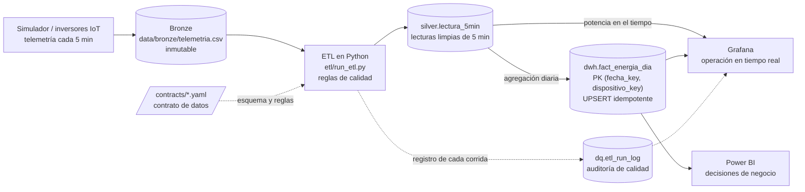

# Arquitectura de SolarBI Pascual

Arquitectura *medallion* sobre una sola base de datos PostgreSQL 16 + TimescaleDB. Los datos fluyen
en una sola dirección; cada capa tiene un esquema propio y los consumidores solo leen.

## Capas

| Capa | Dónde vive | Contenido | Regla principal |
|---|---|---|---|
| Bronze | `data/bronze/` (y esquema `bronze` si se necesita staging en la base) | Telemetría cruda tal como llega | Nunca se modifica |
| Silver | `silver.lectura_5min` | Una fila por dispositivo y marca de tiempo (`dispositivo_id`, `ts`, `p_ac_kw`, `irradiancia_wm2`, `temp_modulo_c`, …) | Solo entran lecturas que cumplen el contrato de datos |
| Gold | `dwh.fact_energia_dia` | Energía diaria (`energia_kwh`, `pct_datos_validos`, …) con PK `(fecha_key, dispositivo_key)` | Carga idempotente (UPSERT): repetir una corrida no duplica datos |
| Calidad | `dq.etl_run_log` | Una fila por corrida: filas leídas, aceptadas, rechazadas y reglas fallidas | Toda corrida queda registrada |

## Consumidores

- **Grafana** (operador): se conecta como `grafana_reader` (solo lectura) y lee `silver` para la
  curva de potencia y `dwh`/`dq` para indicadores y alertas. Datasource y dashboards se aprovisionan
  desde `grafana/` (ver [ADR 0003](adr/0003-dashboards-as-code.md)).
- **Power BI** (gerencia): se conecta como `powerbi_reader` (solo lectura) al modelo estrella de
  `dwh`. El reporte se versiona como proyecto `.pbip`.

## Infraestructura local

`docker-compose.yml` levanta dos servicios en la red `solarbi`:

| Servicio | Imagen | Puerto en el equipo | Volumen |
|---|---|---|---|
| `db` | `timescale/timescaledb:2.30.2-pg16` | `127.0.0.1:${POSTGRES_PORT}` | `pgdata` |
| `grafana` | `grafana/grafana:13.2.3` (edición OSS) | `127.0.0.1:${GRAFANA_PORT}` | `grafana-data` |

Grafana espera a que `db` esté *healthy*. Los puertos solo escuchan en `127.0.0.1`: el ETL y Power
BI Desktop corren en el mismo equipo.

## Preparado para el dataset real (fase 6)

- El esquema del dataset vive en `contracts/` y no en el código ([ADR 0002](adr/0002-config-driven-etl-with-data-contracts.md)).
- El dataset grande se guarda fuera del control de versiones (`.gitignore` y `tests/test_repo_hygiene.py`).
- TimescaleDB permite convertir `silver.lectura_5min` en *hypertable* y precalcular agregados
  continuos para Grafana ([ADR 0001](adr/0001-postgres-with-timescaledb.md)).
