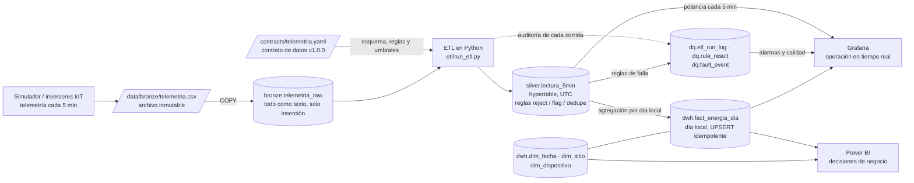
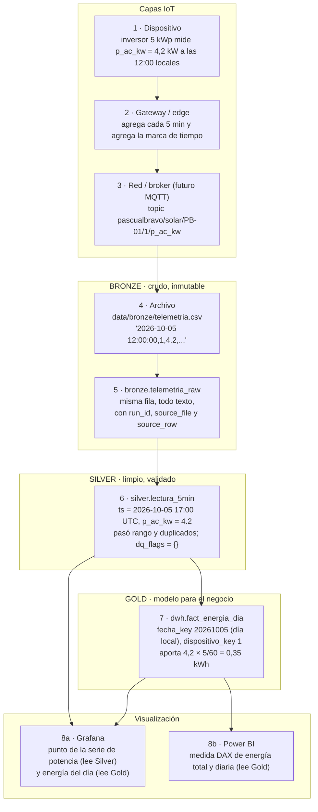
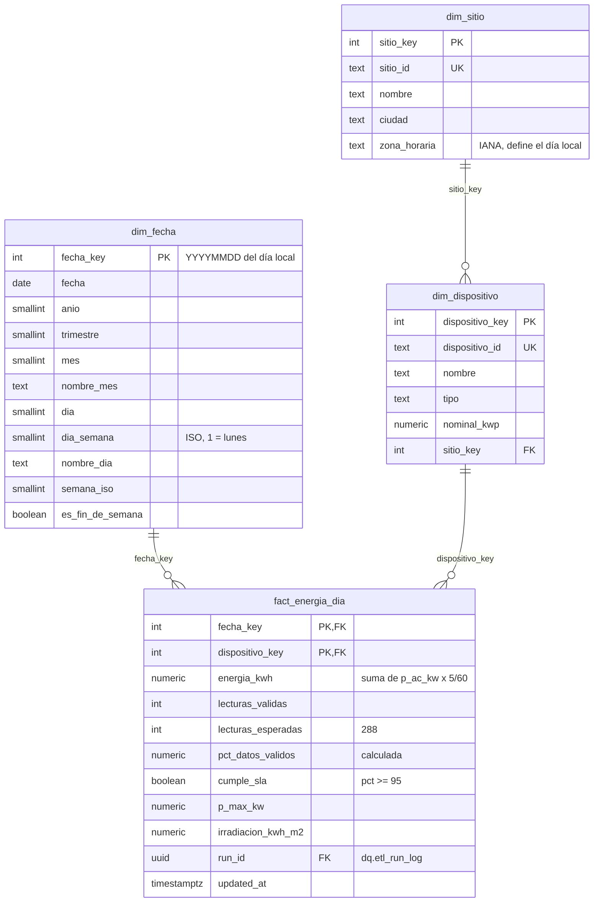

# Arquitectura de SolarBI Pascual

Arquitectura *medallion* sobre una sola base de datos PostgreSQL 16 + TimescaleDB. Los datos fluyen
en una sola dirección, cada capa tiene un esquema propio y los consumidores solo leen. El contrato
de datos (`contracts/telemetria.yaml`) gobierna todo el flujo: columnas, unidades, rangos, reglas
de calidad, reglas de falla y niveles de servicio.

## 1. Flujo general

## 2. El viaje de una lectura

Una sola lectura (inversor 1, 5 de octubre de 2026, 12:00 hora local, 4,2 kW) desde el dispositivo
hasta un visual, capa por capa. Las capas IoT de borde y red son la arquitectura de referencia; hoy
el simulador las reemplaza escribiendo directamente el CSV.

Si la misma lectura hubiera llegado con `p_ac_kw = -1`, se habría quedado en Bronze (intacta) y en
`dq.rule_result` como rechazo de `range_p_ac_kw`; nunca llegaría a Silver ni a Gold. Si hubiera
llegado sin irradiancia, entraría a Silver con `dq_flags = {missing_irradiancia}` y seguiría
sumando energía (ver [ADR 0005](adr/0005-quality-rule-actions-reject-flag-dedupe.md)).

## 3. Capas y tablas

| Capa | Tabla | Grano y contenido | Regla principal |
|---|---|---|---|
| Bronze | `data/bronze/*.csv` | Archivo tal como llega | Nunca se modifica |
| Bronze | `bronze.telemetria_raw` | Una fila por fila del archivo, todo como texto | Solo inserción (un *trigger* rechaza UPDATE, DELETE y TRUNCATE) |
| Silver | `silver.lectura_5min` | Una lectura por `(dispositivo_id, ts)`; `ts` en UTC, ajustado al intervalo de 5 minutos (la hora original queda en `ts_origen`) | Solo entran filas que pasan las reglas `reject` y `dedupe` |
| Gold | `dwh.fact_energia_dia` | Un día **local** por dispositivo | UPSERT idempotente sobre `(fecha_key, dispositivo_key)` |
| Gold | `dwh.dim_fecha`, `dwh.dim_sitio`, `dwh.dim_dispositivo` | Dimensiones del modelo estrella | Sitios y dispositivos salen del contrato |
| Calidad | `dq.etl_run_log`, `dq.rule_result` | Una fila por corrida y una por regla y corrida | Toda corrida queda registrada |
| Calidad | `dq.fault_event` | Un evento por falla detectada | Reglas de falla del contrato, evaluadas sobre Silver |
| Control | `meta.schema_migrations` | Una fila por migración aplicada | Migraciones solo hacia adelante |

## 4. Modelo de datos de `dwh`

## 5. Seguridad y roles

| Rol | Uso | Permisos |
|---|---|---|
| `solarbi_owner` (`POSTGRES_USER`) | Migraciones y administración | Dueño de la base de datos (superusuario de la imagen) |
| `etl_writer` | ETL | No es superusuario; dueño de todas las tablas; `USAGE, CREATE` en `bronze, silver, dwh, dq, meta` |
| `grafana_reader`, `powerbi_reader` | Consumidores | Solo lectura en `silver, dwh, dq` (rol `bi_readonly`); sin acceso a `bronze` |

Las tablas que crea `etl_writer` quedan legibles para los consumidores automáticamente
(`ALTER DEFAULT PRIVILEGES FOR ROLE etl_writer`, migración 0001). Ver
[ADR 0006](adr/0006-forward-only-sql-migrations-and-etl-role.md).

## 6. Infraestructura local

`docker-compose.yml` levanta dos servicios en la red `solarbi`:

| Servicio | Imagen | Puerto en el equipo | Volumen |
|---|---|---|---|
| `db` | `timescale/timescaledb:2.30.2-pg16` | `127.0.0.1:${POSTGRES_PORT}` (5433) | `pgdata` |
| `grafana` | `grafana/grafana:13.2.3` (edición OSS) | `127.0.0.1:${GRAFANA_PORT}` (3000) | `grafana-data` |

`sql/init/` crea la extensión, los esquemas y los roles de lectura en el primer arranque; todo lo
demás llega por migraciones (`python scripts/migrate.py`), de modo que la base evoluciona sin
borrar datos.

## 7. Preparado para el dataset real (fase 6)

- El esquema del dataset vive en `contracts/` y no en el código
  ([ADR 0002](adr/0002-config-driven-etl-with-data-contracts.md)): para una fuente nueva se mapean
  sus columnas en `source_name` y se ajustan unidades, rangos y zona horaria.
- `silver.lectura_5min` ya es *hypertable* con particiones de 7 días; el primer agregado continuo
  será la potencia horaria por dispositivo ([ADR 0001](adr/0001-postgres-with-timescaledb.md)).
- Bronze se carga con `COPY`, la vía que escala a millones de filas.
- El día se calcula en hora local del sitio, aunque se almacene en UTC
  ([ADR 0004](adr/0004-local-day-grain-and-utc-storage.md)).
- El dataset grande nunca entra al repositorio (`.gitignore` y `tests/test_repo_hygiene.py`).
